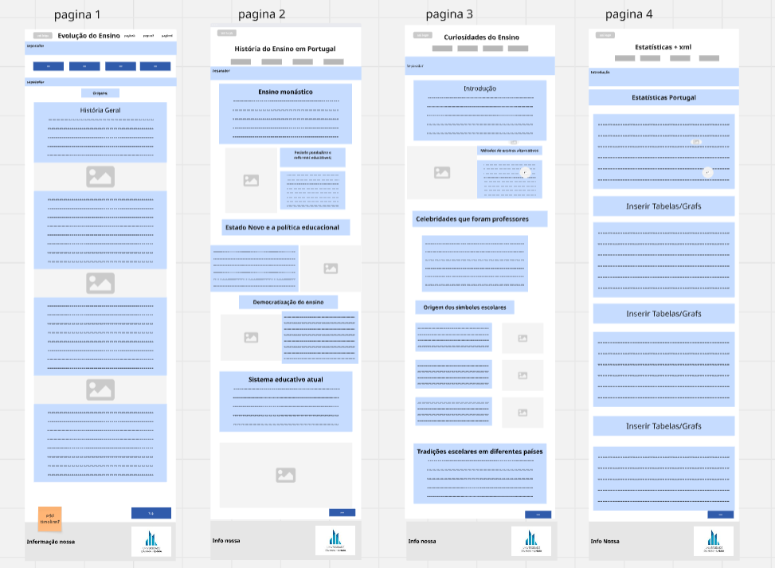

## C2: Interfaces
Para organizar a informação e a maneira como ela era colocada e demonstrada no site, fizemos um wireframe para fazer uma base da interface do site em geral, criando uma imagem base de como cada página seria demonstrada no final. Também realizamos um sitemap para identificar o que se falaria e em que página se falaria.

### Estudo da interface

#### Wireframe

*Na imagem está representado o WireFrame, dividido em 4 partes - representação de cada página -, sendo, cada uma, uma visualização base do que poderia vir a ser cada página no projeto final. Foi feito um "zoomOut" para ser possível visualizar todas*

#### SiteMap

*Na imagem está representado o SiteMap, reprensentando os tópicos abordados em cada página do trabalho.*
