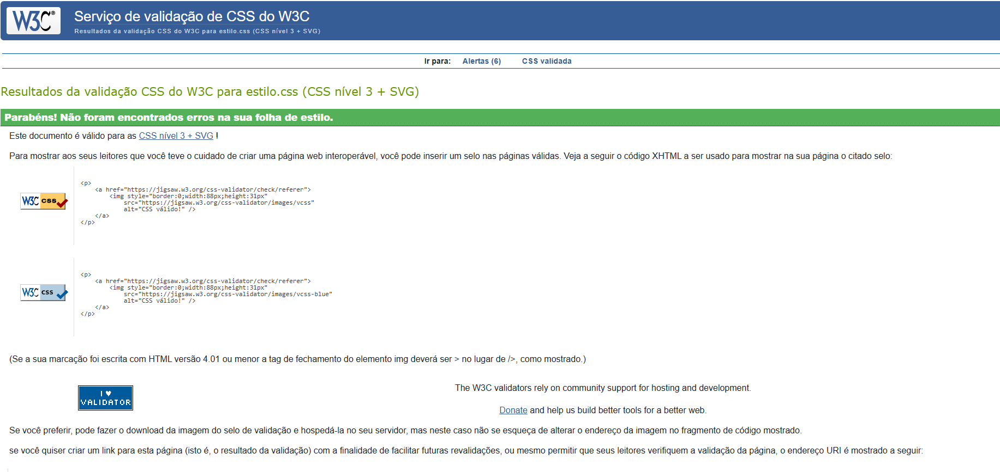
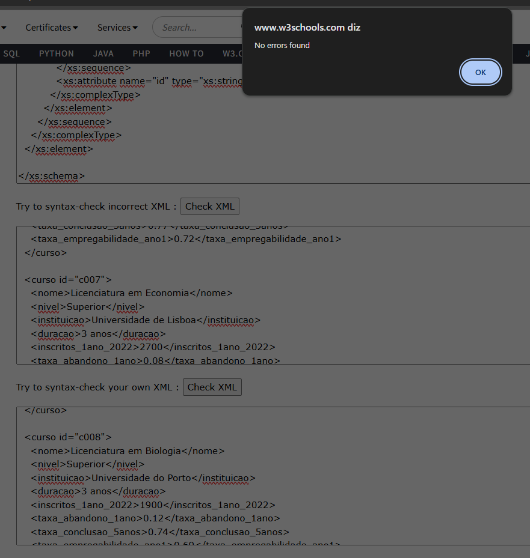

# Capítulo 3: Produto

## Descrição do Produto

Website educativo estático composto por 4 páginas interligadas, desenvolvido com:
- HTML5
- CSS3
- JavaScript (implementado no interior do HTML)
- XML e XSD

Páginas disponíveis:
1. **História do Ensino** - Visão geral da história do ensino
2. **A História do Ensino em Portugal** - Abordagem restringida à história do ensino no país
3. **Curiosidades** - Seccção com curiosidades sobre outros países, entre outros; com formulário no final
4. **Estatísticas** - Dados sobre licenciaturas em Portugal

## 3.1 Instalação

### Organização no Github
1. Criação da organização `inf2425tig04` no GitHub (Organizations -> New Organization)
2. Repositório principal: `trabalho_ti`
3. Adicionamos todos os membros do grupo via convite por email
4. Estrutura de pastas:
- \doc #documentação
- \src #source páginas e os seus requisitos (imagens):
   - \img
   - .html
   - .css
   - .xml
   - .xsd

- README.md

3. Implantação no Netlify:
- Conectamos o repositório GitHub à conta Netlify
- Import GitHub -> Install Repository
- Configuramos para ir buscar a pasta correta ao GitHub, "/src"

## 3.2 Uso e Navegação

1. Acesso ao nosso site: [Site Netlify](https://inf2425tig04.netlify.app/)
   - sem autenticação requerida;    
2. Navegação principal:
   - Cabeçalho com botões que permitem a navegação entre as páginas principais;
   - Na página curiosidades, também tem a possibilidade de, pelo botão "(...) Envie-nos", ir ao fim da página diretamente para a determinada secção;
   - Rodapé contém links onde fornece ligação para o GitHub do projeto, entre outros.

## 3.3 Formulários (em "Curiosidades")
Para restringir uso de caracteres e etc na validação de texto inserido pelo utilizador. Usamos este método:

Primeiro, para inserir o nome:
-  type="text"
usando required...
- pattern="^([A-Za-zÀ-ÿ]+(\s)?){2,4}$":
  - Aceita apenas: Letras (incluindo acentuadas)
  - 2 a 4 palavras separadas por espaços
- minlength="5" e maxlength="50" - como limite de caracteres

Segundo, a curiosidade:
com required...
- rows="5" - Altura inicial (5 linhas)
- minlength="20" e maxlength="500" - como limite de caracteres

```html
<section>
        <h2>Partilhe a sua Curiosidade!</h2>
        <form action="#" method="post" id="form-curiosidade">
          <label for="nome">Seu nome:</label>
          <input
            type="text"
            id="nome"
            name="nome"
            placeholder="Ex: Ana Silva"
            required
            pattern="^([A-Za-zÀ-ÿ]+(\s)?){2,4}$"
            title="Insira entre 2 e 4 palavras, apenas letras e espaços."
            minlength="5"
            maxlength="50"
          >

          <label for="curiosidade">Sua curiosidade:</label>
          <textarea
            id="curiosidade"
            name="curiosidade"
            rows="5"
            placeholder="Escreva aqui uma curiosidade sobre o ensino..."
            required
            minlength="20"
            maxlength="500"
          ></textarea>

          <button type="submit">Enviar Curiosidade</button>
        </form>
```

## 3.4 Validação (HTML e CSS) e Exemplos de Validação
Inserimos cada ficheiro, html e css, ao respetivo site, validando-os. Se houvesse erro, corrigiamos e validavamos novamente... até estar válido após as alterações.

1. Validador HTML5 neste repositório:
[Validador HTML5](https://validator.w3.org/nu/?showsource=yes&showoutline=yes&showimagereport=yes&doc=https%3A%2F%2Fgithub.com%2Finf2425tig04%2Ftrabalho_ti)
2. Validador CSS3 neste repositório:
[Validador CSS W3C](https://jigsaw.w3.org/css-validator/validator?uri=https%3A%2F%2Fgithub.com%2Finf2425tig04%2Ftrabalho_ti)


*Resultado da validação de uma das páginas html*

*Resultado da validação da página do css*

## 3.5 Detalhes de Implementação

- Requisitos Mandatórios

  *Page Requirements*
  | Requirement | Usage Example |
  | :---: | :---: |
  | Index HTML |  src/index.html  |
  | Portugal HTML |src/portugal.html|
  | Curiosidades HTML |src/curiosidades.html|
  | Estatísticas HTML |src/estatisticas.html|
  | Cursos Schema XML | src/cursos.xml |
  | Cursos Schema XSD |src/cursos_schema.xsd |
  | Estilo CSS | src/estilo.css |


A validação do XML foi feita através do site: [W3Schools](https://www.w3schools.com/xml/xml_validator.asp).
  - Esta foi feita da mesma maneira que as páginas anteriores: verificar se válido colocando o ficheiro -> se não estiver válido, alteramos até ser válido vendo, novamente, a sua situação de validez após as alterações

   

*Resultado da validação do documento xml -> canto superior direito: sem erros*


- Requisitos Mínimos HTML
  | Requisitos | Exemplo de Uso |
  | :---: | :---: |
  | Download do XML |    https://github.com/inf2425tig04/trabalho_ti/blob/48d10ca3666fffd2d203c4b2644a4e31d35867cb/src/estatisticas.html#L81-L84  |
  | Download do XSD |    https://github.com/inf2425tig04/trabalho_ti/blob/7f4150c8e1002bb014fe3a18a1843c8e0c62ed2f/src/estatisticas.html#L87-L90  |
  | Tabela |     https://github.com/inf2425tig04/trabalho_ti/blob/7f4150c8e1002bb014fe3a18a1843c8e0c62ed2f/src/curiosidades.html#L54-L89 |
  | Lista Ordenada | https://github.com/inf2425tig04/trabalho_ti/blob/7f4150c8e1002bb014fe3a18a1843c8e0c62ed2f/src/portugal.html#L168-L179 |
  | Lista Desordenada | https://github.com/inf2425tig04/trabalho_ti/blob/7f4150c8e1002bb014fe3a18a1843c8e0c62ed2f/src/portugal.html#L118-L123  |
  | Lista de Descrição |    https://github.com/inf2425tig04/trabalho_ti/blob/7f4150c8e1002bb014fe3a18a1843c8e0c62ed2f/src/curiosidades.html#L234-L272  |
  | Lista Alinhada |    https://github.com/inf2425tig04/trabalho_ti/blob/7f4150c8e1002bb014fe3a18a1843c8e0c62ed2f/src/curiosidades.html#L99-L139 |
  | Marcação de Texto | https://github.com/inf2425tig04/trabalho_ti/blob/3009672b470f7980ca1f1f719cb8853c4b1cbda4/src/portugal.html#L53-L54 |
  | Imagem |   https://github.com/inf2425tig04/trabalho_ti/blob/3009672b470f7980ca1f1f719cb8853c4b1cbda4/src/portugal.html#L74   |
  | Figure |   https://github.com/inf2425tig04/trabalho_ti/blob/3009672b470f7980ca1f1f719cb8853c4b1cbda4/src/portugal.html#L73-L76 |
  | Figure Caption      |  https://github.com/inf2425tig04/trabalho_ti/blob/3009672b470f7980ca1f1f719cb8853c4b1cbda4/src/portugal.html#L75  |
  | Internal Link |   https://github.com/inf2425tig04/trabalho_ti/blob/9640d596084358c7141bce62f2b75f1577fb8bbb/src/curiosidades.html#L24   |
  | External Link |   https://github.com/inf2425tig04/trabalho_ti/blob/9640d596084358c7141bce62f2b75f1577fb8bbb/src/curiosidades.html#L25  |
  | Form |     https://github.com/inf2425tig04/trabalho_ti/blob/9640d596084358c7141bce62f2b75f1577fb8bbb/src/curiosidades.html#L388-L414  |

  CSS Minimum requirements (usage of/change of)
  | Requirement | Usage Example |
  | :---: | :---: |
  | Type selector |    https://github.com/inf2425tig04/trabalho_ti/blob/80a5eb902945a31b9f43cf2cb2b04b97cae5a866/src/estilo.css#L241-L247   |
  | Id selector |     https://github.com/inf2425tig04/trabalho_ti/blob/80a5eb902945a31b9f43cf2cb2b04b97cae5a866/src/estilo.css#L292-L299  |
  | Class Selector |   https://github.com/inf2425tig04/trabalho_ti/blob/80a5eb902945a31b9f43cf2cb2b04b97cae5a866/src/estilo.css#L73-L81    |
  | Pseudo-class Selector |   https://github.com/inf2425tig04/trabalho_ti/blob/80a5eb902945a31b9f43cf2cb2b04b97cae5a866/src/estilo.css#L117-L121    |
  | Attribute Selector |    https://github.com/inf2425tig04/trabalho_ti/blob/0e1d7c7d52bffa6a431ba8684b6fa80cbaeda2f4/src/estilo.css#L437-L448   |
  | Pseudo-element Selector |  https://github.com/inf2425tig04/trabalho_ti/blob/80a5eb902945a31b9f43cf2cb2b04b97cae5a866/src/estilo.css#L19-L23    |
  | Combinator Selector |   https://github.com/inf2425tig04/trabalho_ti/blob/80a5eb902945a31b9f43cf2cb2b04b97cae5a866/src/estilo.css#L66-L71    |
  | Change Highlight style |   https://github.com/inf2425tig04/trabalho_ti/blob/359da53eaddbc5bb25443557defac027d4aebef7/src/estilo.css#L1127-L1130    |
  | Image insertion |   https://github.com/inf2425tig04/trabalho_ti/blob/c1f4d03b07fdb4709b1078e791ba029a3d17a88f/src/estilo.css#L676-L689    |
  | Hide an element |   https://github.com/inf2425tig04/trabalho_ti/blob/80a5eb902945a31b9f43cf2cb2b04b97cae5a866/src/estilo.css#L589-L591    |
  | Text style |    https://github.com/inf2425tig04/trabalho_ti/blob/80a5eb902945a31b9f43cf2cb2b04b97cae5a866/src/estilo.css#L250-L255   |
  | Font style |   https://github.com/inf2425tig04/trabalho_ti/blob/80a5eb902945a31b9f43cf2cb2b04b97cae5a866/src/estilo.css#L230-L232    |
  | Background style |   https://github.com/inf2425tig04/trabalho_ti/blob/80a5eb902945a31b9f43cf2cb2b04b97cae5a866/src/estilo.css#L28    |
  | float/position style |   https://github.com/inf2425tig04/trabalho_ti/blob/80a5eb902945a31b9f43cf2cb2b04b97cae5a866/src/estilo.css#L901    https://github.com/inf2425tig04/trabalho_ti/blob/80a5eb902945a31b9f43cf2cb2b04b97cae5a866/src/estilo.css#L45    |
  | List style |    https://github.com/inf2425tig04/trabalho_ti/blob/80a5eb902945a31b9f43cf2cb2b04b97cae5a866/src/estilo.css#L88-L89   |
  | Box element style |   https://github.com/inf2425tig04/trabalho_ti/blob/80a5eb902945a31b9f43cf2cb2b04b97cae5a866/src/estilo.css#L95-L103    |
  | table style |    https://github.com/inf2425tig04/trabalho_ti/blob/80a5eb902945a31b9f43cf2cb2b04b97cae5a866/src/estilo.css#L302-L311   |
  | Responsibility style 2 screen sizes |    https://github.com/inf2425tig04/trabalho_ti/blob/80a5eb902945a31b9f43cf2cb2b04b97cae5a866/src/estilo.css#L800-L857   |
  ## Requisitos Extra
   | Requirement | Usage Example |
  | :---: | :---: |
  | Video Element |  https://github.com/inf2425tig04/trabalho_ti/blob/2f0aa1fa1c3fedfc18a98ae7a0161a0f7f48ab32/src/curiosidades.html#L372-L380 |
  | Transition|  https://github.com/inf2425tig04/trabalho_ti/blob/30ce891dd03bb80e6820ab53d2a399a93feb3318/src/estilo.css#L141-L151 |
  | Transform |https://github.com/inf2425tig04/trabalho_ti/blob/30ce891dd03bb80e6820ab53d2a399a93feb3318/src/estilo.css#L368-L376
  | Animation | https://github.com/inf2425tig04/trabalho_ti/blob/30ce891dd03bb80e6820ab53d2a399a93feb3318/src/estilo.css#L657-L660  |
  | Tabela com Dados do XML |  https://github.com/inf2425tig04/trabalho_ti/blob/6e34588c917d6c3474a256ca135a8bcac41a9435/src/estatisticas.html#L99-L194 |
  | Slide Show | https://github.com/inf2425tig04/trabalho_ti/blob/30ce891dd03bb80e6820ab53d2a399a93feb3318/src/curiosidades.html#L424-L449  |

  ---
[< Previous](capitulo_2.md) | [^ Main](https://github.com/inf2425tig04/trabalho_ti/main) | [Next >](capitulo_4.md)
:--- | :---: | ---: 
